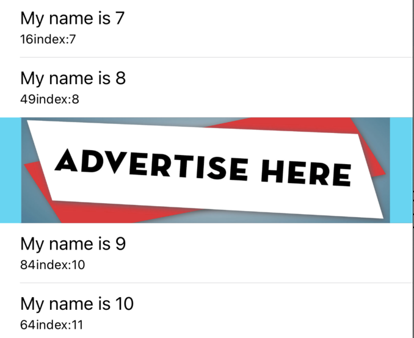

# Cross Promotion with firebase config

Promote your apps for free, the idea is about adding native ads fetched from firebase configfuration to your application, and then you can show many types of ads, and all of analysis of ad click and view logged to firebase analytics

### Why Firebase Configuration?
- To take advantage of custumizing you ads per country or device, .....
- To get the analytics of the ads tap/view on the same firebase anayltics

### Ad Types
- "bannerImage"


- "detaildBanner"


- medium
![(MediumAds.png)]

- interstitial
![(screenshot-interstitial.png)]

- "bannerImageCollectionView"
![(screenshot-interstitial.png)]


### Add Pod   
```sh
pod 'CrossAdsSDK', :git => 'https://github.com/mfa01/CrossAdsWithFirebase.git', :tag => '0.0.2'
```

#### Also you can specify the tag to back to older versions
```sh
pod 'CrossAdsSDK', :git => 'https://github.com/mfa01/CrossAdsWithFirebase.git', :tag => '0.0.2'
```

## Fetching Ads

- Configure firebase in app delegate
- Import the library
- Fetch the ads
```sh
    var crossAds: [CrossAdModel] = []
    
    override func viewDidLoad() {
        super.viewDidLoad()
        
        let config = CrossAdsConfigration()
        CrossAdsManager.shared.start(config: config) { [weak self ] (ads, remoteConfig, error) in
            self?.crossAds = (ads ?? [])
            self?.tableView.reloadData()
        }
    }
```

## Showing Full Ad
```sh
    CrossAdsInterstitialViewController.showAd(adModel: interstitialAd, placeholderImage: nil, inVC: self)
```


## SHowing Ad cell
Once you fetched the ad list from firebase config, then you can show the ads on your table view by specifying the cell like this

```var crossAds: [CrossAdModel] = []```
```let cell = tableView.dequeueCrossAdsCell(crossAd: crossAds[indexPath.row], placeholderImage: nil, height: nil)```

to let sdk choose your ad
```
        let ad = CrossAdsManager.shared.pickAdItem()
        let cell = tableView.dequeueCrossAdsCell(crossAd: ad, placeholderImage: nil, height: nil)``` 


## Make you cell item model confirm to Advertizable protocol

## Whenever you want to show an ad in your tableView
```sh
let cell = tableView.dequeueCrossAdsCell(crossAd: crossAds[indexPath.row], placeholderImage: nil, height: nil)
```
'height' field, can be set for ads cell to manually set the height, keep it nil to handle it automattically


## Ad Model
    public var id: String
    public var image: String?
    public var mainImage: String?
    public var title: String?
    public var actionButtonTitle: String?
    public var subTitle: String?
    public var type: CrossAdType?
    public var url: String?
    public var view_freq: Int?
    public var click_freq: Int?
    public var backgroundColor: String?
    public var allowDismissAfter: Double?


## Firebase Configuration

## Firebase Analytics Configuration


```sh
    let vc = YPlayerWebViewViewController.initPlayer(delegate: self)
    let videoPresenetation = VideoPlayerPresentaion(videoId: "668nUCeBHyY")
    self.present(vc, animated: true) {
        vc.openPageWithVideoId(presentation: videoPresenetation)
    }
```
 ##### Always you can add many options to the presentation struct
 - let videoId: String
 - var autoplay = 1
 - var controls = 1 // show video controls options
 - var color: PlayerColor = .red
 - var playsinline = 1
 - var start: Float = 0.0 // start time
 - var loop = 0
 - var rel = 0 // show related videos after video end
 - var fs = 1 // show full screen option
 - var modestbranding = 0 // show youtube colors
 
## Open youtube with searched text


```sh
    let vc = YPlayerWebViewViewController.initPlayer(delegate: nil)
    vc.webviewType = .searching
    self.present(vc, animated: true) {
        var c = URLComponents(string: "https://www.youtube.com/results")
        c?.queryItems = [
            URLQueryItem(name: "search_query", value: text)
        ]
        guard let url = c?.url else { return print("url fail") }
        vc.openPage(url: url)
    }
```
## Features
```sh
    func getCurrentTime(handler: @escaping (Float?) -> Void)
    func seekTo(time: Float)
    func mute()
    func unMute()
    func isMuted(handler: @escaping (Bool?) -> Void)
    func setVolume(volume: Int)
    func getVolume(handler: @escaping (Int?) -> Void)
    func setPlaybackRate(value: Float)
    func getPlaybackRate(handler: @escaping (Float?) -> Void)
    func getAvailablePlaybackRates(handler: @escaping ([Float]?) -> Void)
    func setLoop(value: Float)
    func setShuffle(value: Float)
    func getVideoLoadedFraction(handler: @escaping (Float?) -> Void)
    func getPlayerState(handler: @escaping (PlayerState) -> Void)
    func getDuration(handler: @escaping (Float?) -> Void)
    func getVideoEmbedCode(handler: @escaping (Float?) -> Void)
    func playVideo()
    func stopVideo()
    func pauseVideo()
    func getIframe()
```
    
    
# for referance https://developers.google.com/youtube/iframe_api_reference
