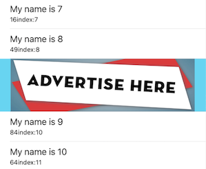
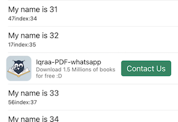

# Cross Promotion with firebase config

Promote your apps for free, the idea is about adding native ads fetched from firebase configfuration to your application, and then you can show many types of ads, and all of analysis of ad click and view logged to firebase analytics


### Why Firebase Configuration?
- To take advantage of customizing your ads per country or device, ..... - To get the analytics of the ads tap/view on the same firebase analytics


## Ad Types
### "bannerImage"


-----

### "detaildBanner"


-----

### "medium"


-----

### "interstitial"


-----

### "bannerImageCollectionView"


-----


### Add Pod   
```sh
pod 'CrossAdsSDK', :git => 'https://github.com/mfa01/CrossAdsWithFirebase.git'
```

#### Also you can specify the tag to back to older versions
```sh
pod 'CrossAdsSDK', :git => 'https://github.com/mfa01/CrossAdsWithFirebase.git', :tag => '0.0.2'
```
```sh
import CrossAdsSDK
```

## Pre Requeirments
- Make sure to have firebase sdk in your project
- Firebase was configured in appdelegate
- Firebase plist file inculuded
- Create firebase remote config, name your config as, ex : "MyAppXCrossAds" with JSON data type 
Note: this name will be used later...
- Add this content sample to the remote config flag, then publish changes
```sh
[
  {
    "id": "adspace",
    "image": "https://i2.wp.com/www.day-today.co.uk/wp-content/uploads/2019/02/advertise-here-banner.jpg?ssl=1",
    "url": "https://lynxmob.com/contact-us",
    "type": "bannerImage",
    "view_freq": 5,
    "click_freq": 1,
    "backgroundColor": "0x3BD6F5",
    "height": 100
  },
  {
    "id": "test-full-banner-twitter-page-elon-musk",
    "image": "https://openseauserdata.com/files/1bbcc86ea8e8927f2b2553bb6120dbc9.jpg",
    "url": "twitter://user?screen_name=elonmusk",
    "backupUrl": "https://www.twitter.com/elonmusk",
    "type": "bannerImage",
    "view_freq": 5,
    "click_freq": 1,
    "backgroundColor": "0x3BD6F5",
    "height": 70
  },
  {
    "id": "iqraa-app-appstore",
    "image": "https://firebasestorage.googleapis.com/v0/b/testproject-a31e1.appspot.com/o/ads%2FBannerIcon%20300x300.jpeg?alt=media&token=2f48a2dd-96f5-4b5b-9305-a4a7b414579c",
    "title": "Iqraa-PDF-whatsapp",
    "subTitle": "Download 1.5 Millions of books for free :D",
    "actionButtonTitle": "Install",
    "url": "https://apps.apple.com/us/app/id1084196602",
    "type": "detaildBanner",
    "view_freq": 5,
    "click_freq": 1,
    "backgroundColor": "0xFFFFFF"
  },
  {
    "id": "pizza-app-appstore",
    "image": "https://firebasestorage.googleapis.com/v0/b/testproject-a31e1.appspot.com/o/ads%2FMediumSizeIcon300x300.png?alt=media&token=d3867eb9-0cbc-4500-8af5-5790a3cf8ab6",
    "mainImage": "https://firebasestorage.googleapis.com/v0/b/testproject-a31e1.appspot.com/o/ads%2FMediumSize900x600.jpeg?alt=media&token=175eb169-2aa1-44a7-b5e2-45987fa85211",
    "title": "Order Now!",
    "subTitle": "We deliver all orders for you",
    "actionButtonTitle": "Install App",
    "url": "https://apps.apple.com/us/app/hungerstation/id596011949",
    "type": "medium",
    "view_freq": 5,
    "click_freq": 1,
    "backgroundColor": "0xF8F0E3"
  },
  {
    "id": "test-full-banner-camp",
    "image": "https://neilpatel.com/wp-content/uploads/2021/02/ExamplesofSuccessfulBannerAdvertising-700x420.jpg",
    "url": "https://www.iqraalibrary.com/",
    "type": "bannerImageCollectionView",
    "view_freq": 5,
    "click_freq": 1,
    "backgroundColor": "0x3BD6F5"
  },
  {
    "id": "pizza-app-appstore-interstitial",
    "image": "https://firebasestorage.googleapis.com/v0/b/testproject-a31e1.appspot.com/o/ads%2FMediumSizeIcon300x300.png?alt=media&token=d3867eb9-0cbc-4500-8af5-5790a3cf8ab6",
    "mainImage": "https://firebasestorage.googleapis.com/v0/b/testproject-a31e1.appspot.com/o/ads%2FMediumSize900x600.jpeg?alt=media&token=175eb169-2aa1-44a7-b5e2-45987fa85211",
    "title": "Order Now!",
    "subTitle": "We deliver all orders for you",
    "actionButtonTitle": "Install App",
    "url": "https://apps.apple.com/us/app/hungerstation/id596011949",
    "type": "interstitial",
    "view_freq": 5,
    "click_freq": 1,
    "backgroundColor": "0xF8F0E3"
  }
]
```

## Now let's start fetching Ads

```sh
override func viewDidLoad() {
    super.viewDidLoad()
    
    let config = CrossAdsConfigration(analyticsEnabled: true, analyticsLogTitle: "TestCrossAds", configName: "MyAppXCrossAds")
        CrossAds.shared.start(config: config) { [weak self ] (ads, remoteConfig, error) in
        print(ads)
    }
}
```

## Let's show your cross ads inside your app

### Showing first interstitial ad in your interstitial cross ads list
After completion of callback, call this code to fetch first interstitial ad in your list
```sh
let interstitialAd = CrossAds.shared.adsInterstitialType.first
if let interstitialAd = interstitialAd {
    CrossAdsInterstitialViewController.showAd(adModel: interstitialAd, placeholderImage: nil, inVC: self)
}
```


## Showing Ad in UITableView
### Types can be shown in UITableView: "bannerImage", "detaildBanner" and "medium"
Once you fetched the ad list from firebase config, then you can show the ads on your table view by specifying the cell like this
Note: no need to register UITableView Cells
```sh
CrossAds.shared.start(config: config) { [weak self ] (ads, remoteConfig, error) in        self?.tableView.reloadData()
}
    
extension ViewController: UITableViewDataSource {
    func tableView(_ tableView: UITableView, numberOfRowsInSection section: Int) -> Int {
        return 1
    }
        
    func tableView(_ tableView: UITableView, cellForRowAt indexPath: IndexPath) -> UITableViewCell {
            
        let item = CrossAds.shared.pickAdItem(type: .bannerImage)
        if let item = item {
            let cell = tableView.dequeueCrossAdsCell(crossAd: item, placeholderImage: nil)
            return cell
        }
        return UITableViewCell()
    }
}
```

## Showing Ad in UITableView with your other items
### Types can be shown in UITableView: "bannerImage", "detaildBanner" and "medium"

Make your table view datasource model adopt 'Advertizable', example:
```sh
struct SampleStruct: Advertizable {
    var isCrossAd: Bool? = false
    
    // Your Data
    var name: String
    var age: String
    var city: String
}
```
Then inject your ads between cells as you like
Example
```sh
lazy var tableItems: [Advertizable] = {
    var items: [SampleStruct] = []
    for index in 0...200 {
        let value = SampleStruct(name: "My name is \(index)", age: "\(arc4random()%100)", city: "My City: \(arc4random()%100)")
        items.append(value)
    }
    return items
}()
```
-------

## Showing CollectionView Banner Ads in ContainerView
### if you want a ready collection view of banners with filled colllection view ads, just use 'FeaturedItemsViewController' and do the following after remote config fetched

Example
- Set duration to zero if you dont want automated scrolling
- Check the sample code 
```sh
    func addFeaturedItems() {
        
        let presentation = FeaturedItemsViewController.ViewData(
            pagerTintColor: .blue,
            pagerCurrentPageColor: .green,
            ads: CrossAds.shared.adsBannerCollectionViewType,
            duration: 2
        )
        
        let controller = FeaturedItemsViewController.instantiate(presentation: presentation)
        addChild(controller)
        controller.view.translatesAutoresizingMaskIntoConstraints = false
        view.addSubview(controller.view)
        NSLayoutConstraint.activate([
            controller.view.leadingAnchor.constraint(equalTo: view.leadingAnchor),
            controller.view.trailingAnchor.constraint(equalTo: view.trailingAnchor),
            controller.view.topAnchor.constraint(equalTo: view.topAnchor),
            controller.view.heightAnchor.constraint(equalToConstant: 300)
        ])
        controller.didMove(toParent: self)
    }
```
-------

## Showing Ad in UICollectionView
### Types can be shown in UICollectionView: 'bannerImageCollectionView'
Register Cells
```collectionView.registerCrossAdsCells()```

Dequeue cell
```sh
let cell = collectionView.dequeueBannerCell(crossAd: CrossAds.shared.adsBannerCollectionViewType[indexPath.row], placeholderImage: nil, indexPath: indexPath)
```

-------

## Ad Model
```sh
    public var id: String
    public var image: String?
    public var mainImage: String?
    public var title: String?
    public var actionButtonTitle: String?
    public var subTitle: String?
    public var type: CrossAdType?
    public var url: String?
    public var backupUrl: String?
    public var view_freq: Int?
    public var click_freq: Int?
    public var backgroundColor: String?
    public var allowDismissAfter: Double?
    public var height: CGFloat?
    public var location: String?
```

## Caching
The ad can be picked base on frequency set in firebase config 'view_freq', the ad shown will not be available if it was shown more than 'view_freq'

## Firebase Analytics Configuration
The much more configurations for firebase analytics, like to add new custom flags in firebase, to make accurate measurements about number of views/clicks on specific ad campaign
